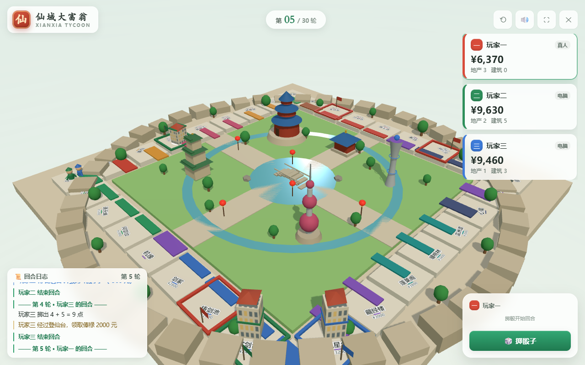
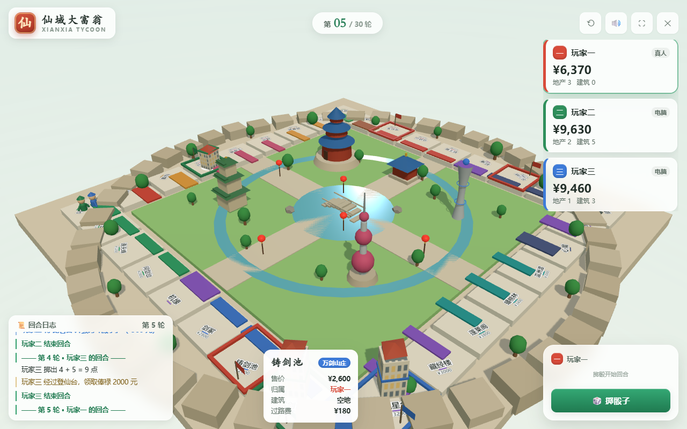

# 仙域大富翁 · Xianxia Tycoon

| 对局总览 | 地块详情浮层 |
| :---: | :---: |
|  |  |

纯前端的 3D 修真题材大富翁游戏：Three.js 沙盘棋盘 + React 界面，规则引擎与渲染层完全解耦，可在浏览器游玩，也可在 Node 中无头仿真校验。

无后端、无外部素材：模型、贴图、音效全部由代码程序化生成。

## 特性

- **3D 环形棋盘**：32 格，八大修真势力、21 座城池；程序化生成的地标建筑群、粒子与镜头动画
- **完整大富翁规则**：掷双骰、购地、过路费、三级晋升（洞府 → 楼阁 → 殿宇 → 仙宫）、抵押 / 赎回
- **宗门联动**：集齐同一势力全部城池后，该势力租金翻倍
- **特殊格**：登仙台（俸禄）、传送阵（可再掷一次）、镇妖塔（受困回合制）、灵脉税、机缘（14 种随机事件）、仙缘 / 心魔（3 回合增益与减益）
- **本地多人**：2 至 4 人同机对局，支持真人席位与三档 AI（简单 / 普通 / 困难）
- **程序化音效**：WebAudio 合成，可一键开关
- **自动存档**：对局写入浏览器本地存储，可继续上次对局
- **规则仿真**：脚本驱动 3 名 AI 跑完整局，并执行 47 项规则断言

## 技术栈

- React 18 + TypeScript
- Vite 5
- Three.js（棋盘、模型、动画）

## 快速开始

环境要求：Node.js 18 及以上。

```bash
npm install
npm run dev
```

浏览器打开 http://localhost:5173 。

Windows 用户也可直接双击 `启动游戏.bat`（脚本会检查 Node、按需安装依赖并启动本地服务）。

## 可用脚本

| 命令 | 说明 |
| --- | --- |
| `npm run dev` | 启动本地开发服务器（端口 5173） |
| `npm run build` | 类型检查并构建到 `dist/` |
| `npm run preview` | 预览构建产物（端口 4173） |
| `npm run sim` | 无头规则仿真与校验（3 人 AI 完整对局 + 47 项断言） |

## 项目结构

```
src/
  game/              规则引擎（不依赖 DOM 与 Three.js）
    board.ts           棋盘数据：八大势力、32 格、地块定义
    rules.ts           数值规则：租金、升级、抵押、赎回、净资产
    events.ts          14 种随机机缘
    ai.ts              三档 AI 决策与负债清算
    controller.ts      回合流转与状态机，暴露 EngineHooks
    save.ts            浏览器存档
    types.ts           类型定义
  three/             3D 渲染层
    SceneEngine.ts     场景装配、补间动画、地块拾取
    models.ts          程序化模型（棋子、建筑、骰子、地块铭牌）
    landmarks.ts       棋盘中心的地标建筑群
  ui/                React 界面层（菜单、HUD、弹窗、浮层）
  audio/             程序化音效
scripts/
  simulate.ts        无头仿真与规则校验脚本
index.html
```

## 玩法规则

- 棋盘共 32 格，掷双骰前进；经过或停留于登仙台可领俸禄 2000
- 无主城池可购入；踩到他人城池需支付过路费；城池可晋升三级，等级越高租金越贵
- 集齐同一势力全部城池即激活宗门联动，该势力租金翻倍
- 传送阵：消耗 800 可立即再掷一次
- 镇妖塔：掷出双同点或受困满 3 回合即可脱身，也可支付赎身费提前离开
- 灵脉税：按名下建筑数量缴纳维护费，每栋 250，最低 500
- 仙缘 / 心魔各持续 3 回合，分别提升收租与增加支出
- 现金为负时需变卖产业清偿，无法清偿即宣告破产

## 架构说明

规则引擎（`src/game`）不引用 DOM 或 Three.js，通过 `EngineHooks`（`dice` / `move` / `build` / `money` / `focus`）向渲染层发出动画意图。构造函数传入 `env = 'node'` 时跳过全部动画延时，因此同一套规则既能在浏览器中游玩，也能被 `scripts/simulate.ts` 无头驱动。

## 开发约定

- 构建即校验：`npm run build` 会先执行 `tsc --noEmit`
- 修改规则数值后请运行 `npm run sim`，确认全部断言通过
- 新增音效请在 `src/audio/sfx.ts` 内用合成方式实现，保持零外部素材

## 部署

仓库已提交构建好的静态产物 `dist/`，可跳过构建直接部署：

1. **零构建部署**：把 `dist/` 目录整个上传到任意静态托管即可（GitHub Pages、Netlify、Vercel、Nginx、对象存储等）
2. **自行构建**：`npm install && npm run build`，产物同样输出到 `dist/`

构建使用相对路径（Vite `base: './'`），因此可部署在任意子目录下（如 `https://example.com/game/`）。由于产物是 ES Module，需通过 HTTP 服务访问，不能以 `file://` 直接双击打开；本地预览可用 `npm run preview`，或进入 `dist/` 后执行 `python -m http.server`。`public/.nojekyll` 会在构建时复制进 `dist/`，用于 GitHub Pages 跳过 Jekyll 处理。

> 说明：`dist/` 内的资源文件名带内容哈希，每次重新构建都会变化并产生一次 diff。若你不想把构建产物纳入版本库，可在 `.gitignore` 中恢复对 `dist/` 的忽略。

仓库内置了 GitHub Actions 工作流（`.github/workflows/deploy-pages.yml`）：推送到 `main` 后会自动安装依赖、构建并将 `dist/` 发布到 GitHub Pages，站点根路径为 `https://<用户名>.github.io/<仓库名>/`。首次使用需在仓库 Settings → Pages 将 Source 设为「GitHub Actions」。

## 许可

本项目基于 [MIT License](./LICENSE) 开源，Copyright (c) 2026 oscar-wang-xin。

---

# Xianxia Tycoon

A pure front-end, 3D board game in the style of Monopoly, set in a Chinese cultivation world. It combines a Three.js sandbox board with a React UI. The rules engine is fully decoupled from rendering, so the same rules run both in the browser and headlessly in Node for simulation testing.

No backend and no external assets: every model, texture and sound is generated procedurally in code.

## Features

- **3D ring board**: 32 tiles, 8 cultivation factions and 21 cities, plus a procedurally generated landmark complex, particles and camera animations
- **Full Monopoly-style rules**: roll two dice, buy tiles, pay rent, three upgrade tiers (Cave Dwelling, Pavilion, Hall, Immortal Palace), mortgage and redeem
- **Faction synergy**: owning every city of a faction doubles that faction's rent
- **Special tiles**: Ascension Terrace (salary), Teleport Array (roll again), Demon-Sealing Pagoda (turn-based confinement), Spirit-Vein Tax, Fortuitous Encounter (14 random events), Immortal Fortune and Inner Demon (3-turn buff and debuff)
- **Local multiplayer**: 2 to 4 players on one machine, with human seats and three AI levels (easy, normal, hard)
- **Procedural audio**: WebAudio synthesis with a one-click mute toggle
- **Autosave**: games are stored in browser localStorage and can be resumed later
- **Rule simulation**: a script drives three AIs through complete games and runs 47 rule assertions

## Tech Stack

- React 18 + TypeScript
- Vite 5
- Three.js (board, models, animation)

## Getting Started

Requires Node.js 18 or later:

```bash
npm install
npm run dev
```

Then open http://localhost:5173 . On Windows you can also double-click `启动游戏.bat`, which checks for Node, installs dependencies on first run and starts the dev server.

## Available Scripts

| Command | Description |
| --- | --- |
| `npm run dev` | Start the local dev server on port 5173 |
| `npm run build` | Type-check and build to `dist/` |
| `npm run preview` | Preview the production build on port 4173 |
| `npm run sim` | Headless rule simulation and verification (three AIs through full games, 47 assertions) |

## Project Structure

```
src/
  game/              Rules engine (no DOM or Three.js dependency)
    board.ts           Board data: 8 factions, 32 tiles, tile definitions
    rules.ts           Numeric rules: rent, upgrades, mortgage, redemption, net worth
    events.ts          14 random Fortuitous Encounter events
    ai.ts              Three AI levels and debt liquidation
    controller.ts      Turn flow and state machine, exposes EngineHooks
    save.ts            Browser save and load
    types.ts           Shared types
  three/             3D rendering layer
    SceneEngine.ts     Scene assembly, tweened animation, tile picking
    models.ts          Procedural models (pawns, buildings, dice, tile plates)
    landmarks.ts       Landmark complex at the board center
  ui/                React UI layer (menu, HUD, modals, overlays)
  audio/             Procedural sound effects
scripts/
  simulate.ts        Headless simulation and rule verification
index.html
```

## Rules

- The board has 32 tiles; roll two dice to move. Passing or landing on the Ascension Terrace grants a salary of 2000
- Unowned cities can be bought; landing on someone else's city pays rent. Cities have three upgrade tiers, and rent grows with each tier
- Owning every city of one faction activates faction synergy and doubles that faction's rent
- Teleport Array: pay 800 to roll again immediately
- Demon-Sealing Pagoda: escape by rolling doubles or after three turns of confinement; a ransom can also be paid to leave early
- Spirit-Vein Tax: pay maintenance based on the number of buildings you own, 250 each with a minimum of 500
- Immortal Fortune and Inner Demon each last 3 turns, raising your rent income or your expenses respectively
- When cash goes negative you must sell assets to settle the debt, otherwise you go bankrupt

## Architecture

The rules engine in `src/game` references neither the DOM nor Three.js. It emits animation intents to the rendering layer through `EngineHooks` (`dice`, `move`, `build`, `money`, `focus`). When the controller is constructed with `env = 'node'` all animation delays are skipped, so the very same rules can be played in the browser and driven headlessly by `scripts/simulate.ts`.

## Development Notes

- Building is also a check: `npm run build` runs `tsc --noEmit` first
- After changing any rule numbers, run `npm run sim` and confirm every assertion passes
- New sound effects should be synthesised inside `src/audio/sfx.ts` to keep the project free of external assets

## Deployment

The repository ships a prebuilt static bundle in `dist/`, so deployment needs no build step:

1. **Deploy as is**: upload the whole `dist/` folder to any static host (GitHub Pages, Netlify, Vercel, Nginx, object storage)
2. **Build yourself**: `npm install && npm run build`, which also outputs to `dist/`

The build uses relative paths (Vite `base: './'`), so it can be served from any subdirectory. Since the output is an ES Module it must be served over HTTP and cannot be opened via `file://`; use `npm run preview` or `python -m http.server` for a local check. `public/.nojekyll` is copied into `dist/` so that GitHub Pages skips Jekyll processing.

> Note: asset filenames in `dist/` include a content hash, so every rebuild produces a diff. To keep build output out of version control, re-add `dist/` to `.gitignore`.

A GitHub Actions workflow (`.github/workflows/deploy-pages.yml`) is included: pushing to `main` installs dependencies, builds the project and publishes `dist/` to GitHub Pages, served at `https://<user>.github.io/<repo>/`. On first use, set Settings → Pages → Source to "GitHub Actions".

## License

Released under the [MIT License](./LICENSE). Copyright (c) 2026 oscar-wang-xin.
